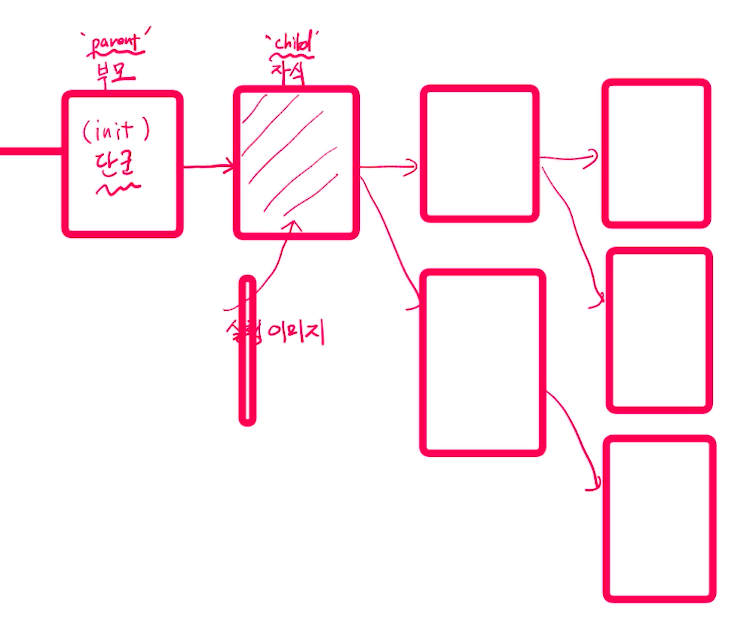

# 제 21강 프로세스 관리 - 프로세스 ID
## 프로세스 관리 - 프로세스 ID 
### 프로그램, 프로세스, 스레드 
- 프로그램: 바이너리, 코드 이미지, 응용 프로그램, Application 또는 실행파일
- 프로세스: 실행중인 프로그램(메모리 적재 + 프로세스 상태 정보 포함(PCB))
- 스레드 
  - 리눅스 기본 프로세스는 기본 스레드 포함
  - 싱글스레드 프로세스: 기본 프로세스
  - 멀티스레드 프로세스: 여러 스레드 존재 

---
## 프로세스 ID 
- pid, 각 프로세스는 해당 시점에 unique한 pid를 가짐
- pid 최대값은 32768  
- 부호형(signed) 16비트 정수값 사용 
> 2^15

```
$ sudo vi /proc/sys/kernel/pid_max
```

- 최근 할당된 pid가 200이라면, 그 이후는 201,202... 식으로 할당

---
## 프로세스 계층 
- 최초 프로세스: init 프로세스, pid 1
- init 프로세스는 운영체제가 생성
- 다른 프로세스는 또다른 프로세스로부터 생성
  - 부모 프로세스, 자식 프로세스
- ppid 값이 부모 프로세스의 pid를 뜻함

  

---
## 실습
- ppid 값 확인해보기
```
$ ps -ef
# -e: 시스템상의 모든 프로세스에 대한 정보 출력 
# -f: 다음 목록 출력(UID(사용자 이름), PID, PPID, CPU%, STIME, TTY, TIME, CMD)
```

---
## 프로세스와 소유자(owner) 관리 
- 리눅스 내부에서는 프로세스의 소유자(사용자)와 그룹을 UID/GID(정수)로 관리 
- 사용자에 보여줄 때에만 UID와 사용자 이름 매핑 정보를 기반으로 사용자 이름으로 제공 
```
$ ps -ef
$ sudo vi /etc/passwd
$ sudo vi /etc/shadow
```
- /etc/passwd 확인하기 
| 항목 | 예1 | 예2 |
|---|---|---|
| 사용자명(아이디) | root | ubuntu |
| 패스워드 | x | x |
| 사용자ID(UID) | 0 | 1000 |
| 그룹ID(GID) | 0 | 1000 |
| 사용자 정보 | root | ubuntu |
| 홈디렉토리 | /root | /home/directory |
| 쉘환경 | /bin/bash | /bin/bash |
