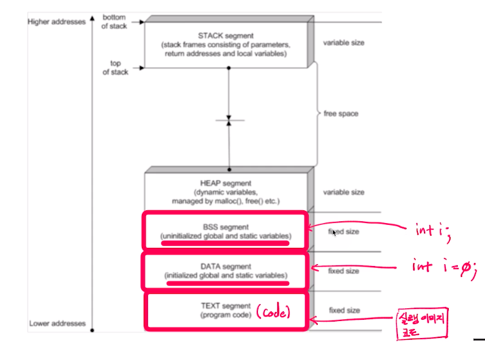

# 제 23강 프로세스 관리 - 프로세스 생성(fork)
## 프로세스 관리 - 프로세스 생성
### 프로세스 기본구조
- TEXT, DATA, BSS, HEAP, STACK



---
## 프로세스 생성
- 기본 프로세스 생성 과정
  - TEXT, DATA, BSS, HEAP, STACK의 공간을 생성
  - 프로세스 이미지를 해당 공간에 업로드하고 실행 시작
- 프로세스 계층: 다른 프로세스는 또다른 프로세스로부터 생성
  - 부모 프로세스, 자식 프로세스  

---
## fork()와 exec() 시스템콜
- fork() 시스템콜: 복사
  - 새로운 프로세스 공간을 별도로 만들고, fork() 시스템콜을 호출한 프로세스(부모 프로세스) 공간을 모두 복사 
    - 별도의 프로세스 공간을 만들고, 부모 프로세스 공간의 데이터를 그대로 복사 
- exec() 시스템콜: 덮어씌움
  - exec() 시스템콜을 호출한 현재 프로세스 공간의 TEXT, BSS, DATA 영역을 새로운 프로세스의 이미지로 덮어씌움
    - 별도의 프로세스 공간을 만들지 않음

---
## fork() 시스템콜
```
헤더 파일: <unistd.h>
함수 원형: pid_t fork(void); // 인자 없음
```       
```c
#include <sys/types.h>
#include <unistd.h>
#include <stdio.h>

int main() {
    pid_t pid;
    printf("Before fork() call \n");
    pid = fork();

    if(pid == 0) {
        printf("This is Child process. PID is %d\n", pid);
    }
    else if(pid > 0) {
        printf("This is Parent process. PID is %d\n", pid);
    }
    else {
        printf("fork() is failed\n");
    }

    return 0;
}
```

## fork() 정리
- pid = fork()가 실행되면 부모 프로세스와 동일한 자식 프로세스가 별도 메모리 공간에 생성 
- 자식 프로세스는 pid가 0으로 리턴, 부모 프로세스는 실제 pid 리턴
- 두 프로세스의 변수 및 PC(Program Count) 값은 동일
- 새로운 프로세스 공간을 별도로 만들고, fork() 시스템콜을 호출한 프로세스(부모 프로세스) 공간 모두를 복사한 후, fork() 시스템콜 이후 코드부터 실행