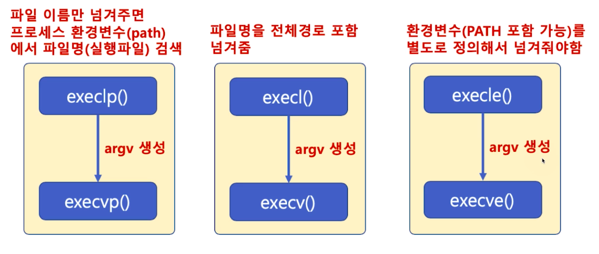

# 제 24강 프로세스 관리 - 프로세스 생성(exec)
## 프로세스 관리 - 프로세스 생성
### fork()와 exec() 시스템콜
- fork() 시스템콜: 복사
  - 새로운 프로세스 공간을 별도로 만들고, fork() 시스템콜을 호출한 프로세스(부모 프로세스) 공간을 모두 복사 
    - 별도의 프로세스 공간을 만들고, 부모 프로세스 공간의 데이터를 그대로 복사 
- exec() 시스템콜: 덮어씌움
  - exec() 시스템콜을 호출한 현재 프로세스 공간의 TEXT, BSS, DATA 영역을 새로운 프로세스의 이미지로 덮어씌움
    - 별도의 프로세스 공간을 만들지 않음

---
## exec() 시스템콜 family
- 헤더 파일: <unistd.h>
- 함수 원형:     
```c
int execl(const char *path, const char *arg, ...);
int execlp(const char *file, const char *arg, ...);
int execle(const char *path, const char *arg, ..., char * const envp[]);
int execv(const char *path, char *const argv[]);
int execvp(const char *file, char *const argv[]);
int execvpe(const char *file, char *const argv[], char *const envp[]);
```

---
## execl() 시스템콜 예 
```c
#include <unistd.h>
#include <stdio.h>
#include <stdlib.h>

int main() {
    printf("execute ls\n");
    execl("/bin/ls", "ls", "-l", NULL); // 마지막에 null을 넣어줘야함
    perror("execl is failed\n"); // 에러 출력 
    exit(1); // 에러 코드 출력
}
```

---
## execl()과 execlp() 시스템콜 사용법
```
execl("디렉토리와 파일 이름이 합친 전체 이름", "명령어 인수 리스트", "끝은 NULL로 끝나야함");
```
```
// 파일 이름을 해당 프로세스를 실행한 프로세스의 환경변수(path)를 검색함 
execlp("파일 이름", "명령어 인수 리스트", "끝은 NULL로 끝나야함");
```
- 명령어 인수 리스트 
  - argv[0] = "ls"
  - argv[1] = "-al"

```
$ ls -al
```  
```
execl("/bin/ls", "ls", "-al", NULL);
```
```
execlp("ls", "ls", "-al", NULL);
```

---
## execle() 시스템콜 사용법 
```c
// 환경변수를 지정하고자 할 때 
// (char *)0은 NULL로 표기해도 됨(NULL과 같은 의미)
char *envp[] = {"USER=ubuntu", "PATH=/bin", (char *)0};
execle("ls", "ls", "-al", NULL, envp);
```

---
## execv(), execvp(), execve() 시스템콜 사용법 
```c
// 인수 리스트를 내용으로 하는 문자열 배열
char *arg[] = {"ls", "-al", NULL};
execv("/bin/ls", arg);
```
```c
// 파일 이름을 해당 프로세스를 실행한 프로세스의 환경변수(PATH)를 검색함
char *arg[] = {"ls", "-al", NULL};
execvp("ls", arg);
```
```c
// 환경변수를 지정하고자 할 때 
char *envp[] = {"USER=ubuntu", "PATH=/bin", (char *)0};
// 인수 리스트를 내용으로 하는 문자열 배열 
char *arg[] = {"ls", "-al", NULL};
execve("ls", arg, envp);
```

---
## execve() 시스템콜 예시
- 환경변수를 새로 생성하므로, 기존 사용자가 설정한 환경변수 값은 사용할 수 없음 
  - 아래 코드에서 envp에는 PATH를 설정하지 않았으므로 execve()에서 "/bin/ls"로 전체 경로를 써야 실행 가능 

```c
#include <unistd.h>
#include <stdio.h>
#include <stdlib.h>

int main() {
    char *envp[] = {"USER=ubuntu", NULL};
    char *arg[] = {"ls", "-al", NULL};

    printf("execute ls\n");
    execve("/bin/ls", arg, envp); 
    perror("execve is failed\n"); // 에러 출력 
    exit(1); // 에러 코드 출력
}
```

---
## exec() 시스템콜 family 정리



---
## execl() 시스템콜 예 
- execl() 시스템콜을 실행시킨 프로세스 공간에 새로운 프로세스 이미지를 덮어씌우고, 새로운 프로세스를 실행
- perror() 함수가 호출된다는 의미는 새로운 프로세스 이미지로 덮어씌우는 작업이 실행되지 못했다는 의미 
  - 즉, execl() 시스템콜 실행 실패 