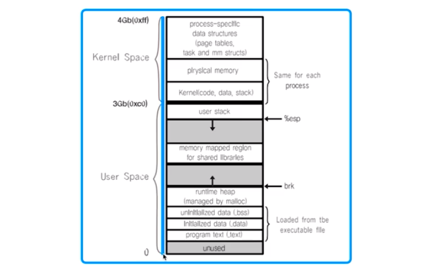
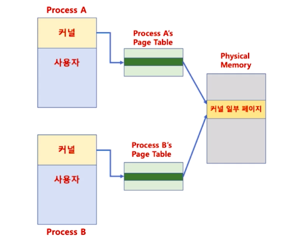
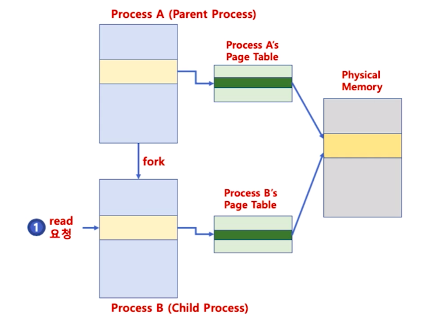
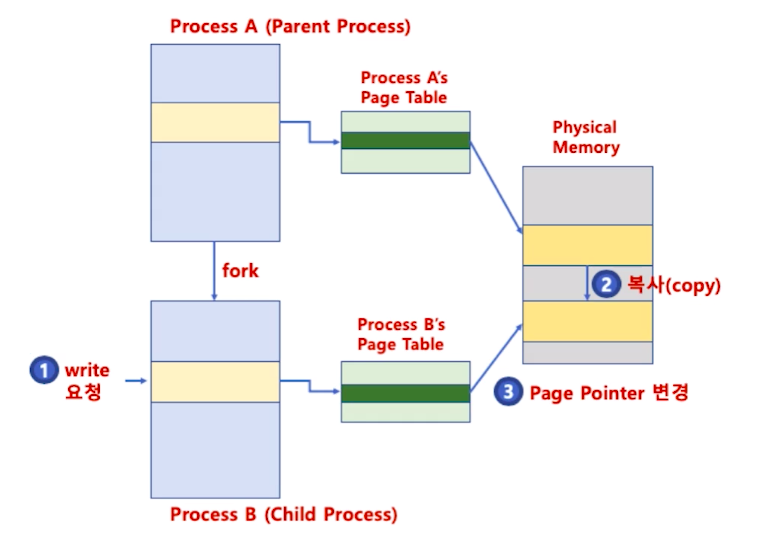

# 제 26강 프로세스 관리 - 프로세스 생성 (copy on write)
## 리눅스 프로세스 
- 프로세스당 4GB 가상 메모리 할당 

- 사용자(0GB ~ 3GB), 커널(3GB~4GB)

> 실제로 커널에 할당한 가상 메모리는 프로세스간 공유 

---
## copy-on-write
- fork()는 새로운 프로세스 공간 생성 후, 기존 프로세스 공간 복사
> 4GB를 복사한다면, 프로세스 생성 시간이 오래 걸림

- 자식 프로세스 생성 시, 부모 프로세스 페이지를 우선 사용
- 부모 또는 자식 프로세스가 해당 페이지를 읽기가 아닌 쓰기를 할 때 
  - 이 때 페이지를 복사하고 분리함 
- 장점 
  - 프로세스 생성 시간을 줄일 수 있음
  - 새로 생성된 프로세스에 새롭게 할당되어야 하는 페이지 수도 최소화   

---
## copy-on-write(read 시)
- 자식 프로세스 생성 시, 부모 프로세스 페이지를 우선 사용

---
## copy-on-write(write 시)
- 부모 또는 자식 프로세스가 해당 페이지를 읽기가 아닌 쓰기 처음 요청시 페이지 복사 및 분리 

