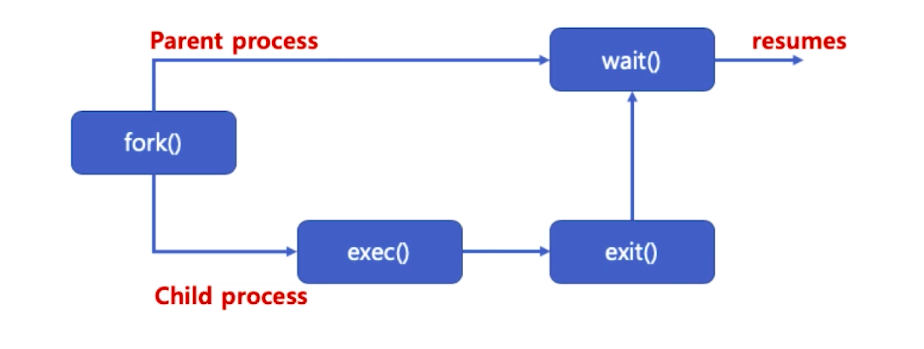

# 제 28강 프로세스 관리 - 프로세스 생성과 종료 총정리 및 wait 시스템콜 상세
## wait() 시스템콜
- wait() 함수를 이용하면, fork() 함수 호출시, 자식 프로세스가 종료할 때까지, 부모 프로세스가 기다림 
- 자식 프로세스가 종료되면, 좀비 프로세스가 되어, 해당 프로세스 조사를 위한 최소 정보만 가지고 있는 상태가 됨 
- 완전히 끝나면, 해당 정보도 삭제되고 부모 프로세스에 SIGCHLD 시그널이 보내짐



---
## wait() 시스템콜 
- wait() 리턴값
  - 에러가 발생한 경우 
```c
#include <sys/wait.h>
pid_t wait(int *status)
// 리턴값은 종료된 자식 프로세스의 pid
```
- status 정보를 통해 기본적인 자식 프로세스 관련 정보를 확인할 수 있음 
  - 예: 
```c
// 자식 프로세스 정상 종료 시 리턴값은 0이 아닌 값이 됨 
int WIFEXITED(status);
```  

```c
#include <unistd.h>
#include <stdlib.h>
#include <stdio.h>
#include <string.h>
#include <sys/wait.h>
#include <sys/types.h>

int main() {
    int pid;
    int child_pid;
    int status;
    int ret;
    pid = fork();

    switch(pid) {
        case -1 : 
            perror("fork is failed\n");
            break;
        case 0 : 
            execl("/bin/ls", "ls", "-al", NULL);
            perror("execl is failed\n");
            break;
        default :
            child_pid = wait(&status);
            printf("Parent PID (%d), Child PID (%d)\n", getpid(), child_pid);
            ret = WIFEXITED(status);
            if(ret != 0) {
                printf("Child process is normally termincated\n");
            } else {
                printf("Child process is abnormally termincated\n");
            }        
            exit(0);
    }
}
```