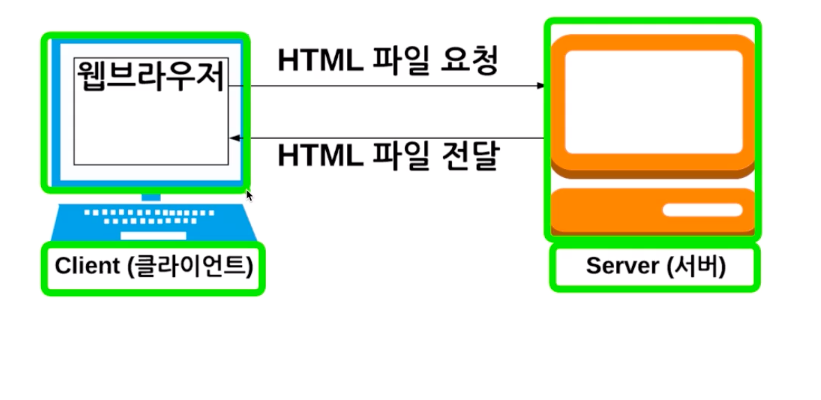
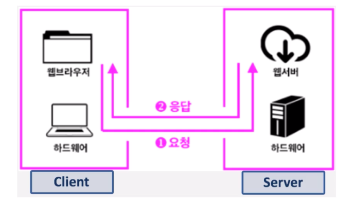
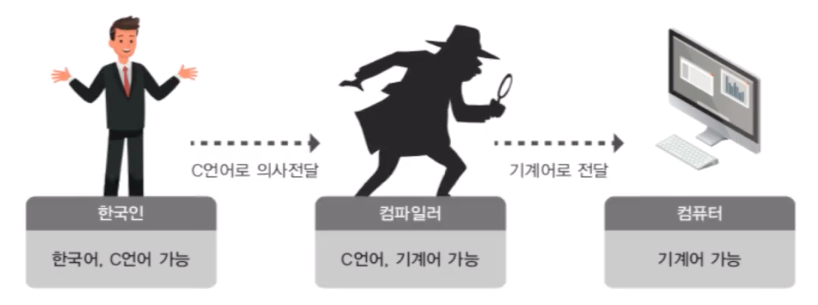

# 제 2강 리눅스 특징과 장점
## 한 번은 알아둬야 할 리눅스 배경, 역사, 철학 
### 리눅스(LINUX)
- 서버에 많이 사용되는 운영체제 

---
## 리눅스(LINUX)
- 최근 서버 환경은 주로 리눅스

---
## 리눅스(LINUX)
- 프로그래밍 할 때에도 많이 사용 됨 
- 빠른 컴파일을 위해 최소한의 프로그램만 설치한다.
  - kernel + shell + system 기본 프로그램 

  

---
## 리눅스(LINUX)
- 클라우드 컴퓨팅(AWS)

---
## 리눅스(LINUX)
- 운영체제, 소프트웨어의 대부 UNIX 계열 운영체제 
  - 완전 프로그래머 스타일 

---
## 리눅스(LINUX)
- plain 하게 프로그래밍이 가능 
  - ANSI C - C 언어 표준 

---
## 정리 
- 리눅스 
  - 서버 + 클라우드 컴퓨팅 
  - 프로그래밍에도 유용 
  - UNIX 계열 운영체제이므로, 사용법을 익힐 수 있다.   
  
