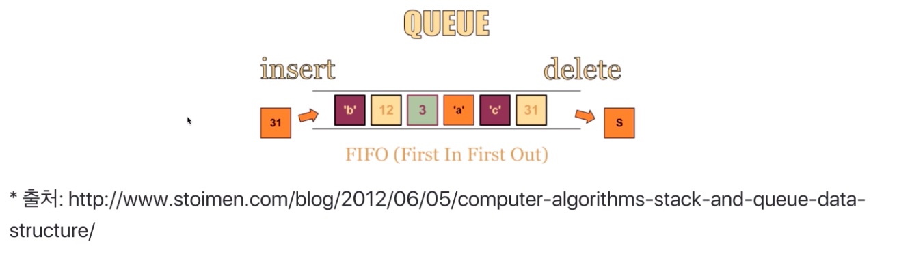
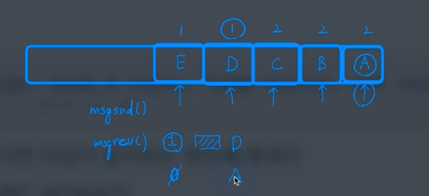

# 제 30강 IPC 기법 실습1
## 파이프 
- pipe(파이프)
  - 기본 파이프는 단방향 통신 
  - fork()로 자식 프로세스 만들었을 때, 부모와 자식간의 통신

  

```c
#include <stdio.h>
#include <stdlib.h>
#include <unistd.h>
#define MSGSIZE 255

char* msg = "Hello Child Process!";
int main() {
    char buf[255];
    int fd[2], pid, nbytes;
    if(pipe(fd) < 0) { // pipe(fd)로 파이프 생성, 커널영역에 생김
        exit(1);
    }
    // 이 함수 실행 다음 코드로부터 부모/자식 프로세스로 나뉘어짐
    pid = fork();
    if(pid > 0) { // 부모 프로세스에는 자식 프로세스 pid값이 들어감
        printf("Parent PID: %d, Child PID: %d\n", getpid(), pid);
        write(fd[1], msg, MSGSIZE); // fd[1]에 씁니다
        exit(0);
    }else { // 자식 프로세스에는 pid값이 0이 됨
        printf("Child PID: %d, pid : %d\n", getpid(), pid);
        nbytes = read(fd[0], buf, MSGSIZE); // fd[0]으로 읽음
        printf("%d %s\n", nbytes, buf);
        exit(0);
    }

    return 0;
}

```

---
## 메세지 큐(message queue)
- 큐니까 기본은 FIFO 정책으로 데이터 전송 



---
## 메세지 큐 코드 예제
```c
msqid = msgget(key, msgflg) // key는 1234, msgflg는 옵션
```
- msgflg 설정
  - IPC_CREAT: 새로운 키면 식별자를 새로 생성, IPC_CREAT| 접근권한
  - IPC_CREAT|0644 -> -rw-r--r--

```c
msgsnd(msqid, &sbuf, buf_length, IPC_NOWAIT)
```  
- msgflg 설정: 블록 모드(0) / 비블록 모드(IPC_NOWAIT)

## 메세지 큐 전송 프로그램 일부 코드 예 
```c
msqid = msgget(1234, IPC_CREAT|0644) // key는 1234, msgflg는 옵션
msgsnd(msqid, &sbuf, buf_length, IPC_NOWAIT)
```

---
## 메세지 큐 코드 예제
```c
ssize_t msgrcv(int msqid, void *msgp, size_t msgsz, long msgtyp, int msgflg)
msgrcv(msqid, &rbuf, MSGSZ, 1, 0) // msgrcv 예 
```
- msgtyp 설정: 0이면 첫번째 메세지, 양수이면 타입이 일치하는 첫번째 메세지
- msgflg 설정: 블록 모드(0)/비블록 모드(IPC_NOWAIT)

## 메세지큐 수신 프로그램 일부 코드 예제
```c
msqid = msgget(1234, IPC_CREAT|0644)
msgrcv(msqid, &rbuf, MSGSZ, 1, 0)
```

```c
// msgqueuesend.c
#include <sys/msg.h>
#include <stdlib.h>
#include <stdio.h>
#include <string.h>

typedef struct msgbuf {
    long type;
    char text[50];
} MsgBuf;

int main(void) {
    MsgBuf msg;
    int msgid, len;
    key_t key = 1234;
    msgid = msgget(key, IPC_CREAT|0644);
    if(msgid == -1) {
        perror("msgget");
        exit(1);
    }
    msg.type = 1;
    strcpy(msg.text, "Hello Message Queue\n");
    if(msgsnd(msgid, (void*)&msg, 50, IPC_NOWAIT) == -1) {
        perror("msgsnd");
        exit(1);
    }

    return 0;
}
```

```c
// msgqueuercv.c
#include <sys/msg.h>
#include <stdlib.h>
#include <stdio.h>
#include <string.h>

typedef struct msgbuf {
    long type;
    char text[50];
} MsgBuf;

int main(void) {
    MsgBuf msg;
    int msgid, len;
    key_t key = 1234;
    if((msgid = msgget(key, IPC_CREAT|0644)) < 0) {
        perror("msgget");
        exit(1);
    }
    len = msgrcv(msgid, &msg, 50, 0, 0);
    printf("Received Message is [%d] %s\n", len, msg.text);

    return 0;
}
```



- 다른 프로세스인데도 통신이 된다.

```c
// msgqueuesendrcv.c
#include <sys/msg.h>
#include <stdlib.h>
#include <stdio.h>
#include <string.h>

typedef struct msgbuf {
    long type;
    char text[50];
} MsgBuf;

int main(void) {
    MsgBuf msg;
    int msgid, len;
    key_t key = 1234;
    msgid = msgget(key, IPC_CREAT|0644);
    if(msgid == -1) {
        perror("msgget");
        exit(1);
    }
    msg.type = 1;
    strcpy(msg.text, "Hello Message Queue\n");
    if(msgsnd(msgid, (void*)&msg, 50, IPC_NOWAIT) == -1) {
        perror("msgsnd");
        exit(1);
    }

    len = msgrcv(msgid, &msg, 50, 0, 0);
    printf("Received Message is [%d] %s\n", len, msg.text);

    return 0;
}
```

---
## 참고: ftok()
- ftok(): 키 생성을 위한 함수 
  - path 경로명의 inode값과 숫자값(id)를 기반으로 키 생성 
  - 경로 삭제 후 재생성시 inode 값이 달라지므로, 이전과는 다른 키값이 리턴 

```c
# include <sys/ipc.h>

key_t ftok(const char *path, int id);

//예
key = ftok("keyfile", 1);
id = msgget(key, IPC_CREAT|0640);
```  