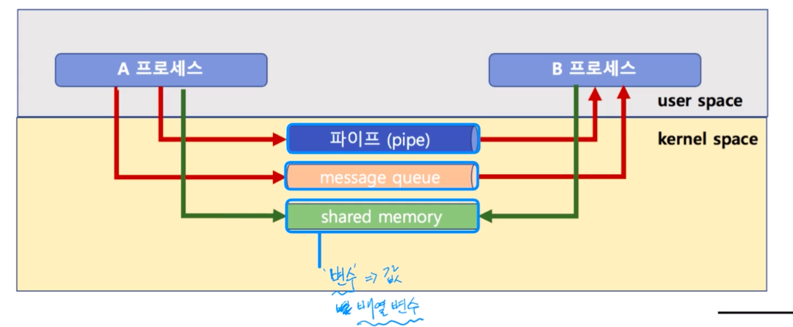

# 제 31강 IPC 기법 실습2
## IPC 모드와 커널 모드
> pipe, message queue는 모두 kernel 공간의 메모리를 사용합니다.


```c
// msgctl: 메세지를 컨트롤 한다는 의미 -> 메세지 큐를 삭제
msgctl(msgid, IPC_RMID, 0); 
```

---
## 공유 메모리(shared memory)
- 노골적으로 kernel space에 메모리 공간을 만들고 해당 공간을 변수처럼 쓰는 방식 
- message queue처럼 FIFO 방식이 아니라 해당 메모리 주소를 마치 변수처럼 접근하는 방식
- 공유 메모리 key를 가지고 여러 프로세스가 접근 가능 



---
## 공유 메모리 코드 예제 

```c
#include <sys/types.h>
#include <sys/ipc.h>
#include <sys/shm.h>

// key: 임의 숫자 또는 ftok 함수로 생성한 키 값 
// size: 공유 메모리 크기 
// shmflg: 공유 메모리 속성 
// 리턴 값: 공유 메모리 식별자 리턴
int shmget(key_t key, size_t size, int shmflg);

// 예
shmid = shmget((key_t)1234, SIZE, IPC_CREAT|0666);
```
